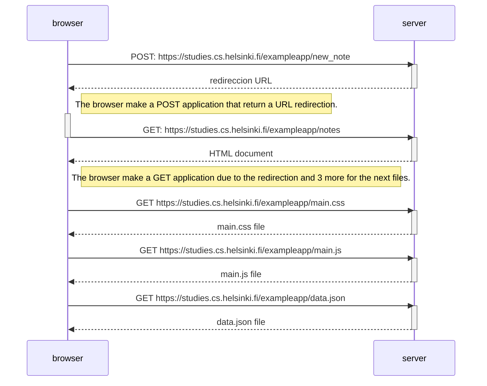

```mermaid
sequenceDiagram
    participant browser
    participant server

    browser->>server: POST: https://studies.cs.helsinki.fi/exampleapp/new_note
    activate server
    server-->>browser: redireccion URL
    deactivate server

    Note right of browser: The browser make a POST application that return a URL redirection.

    activate browser
    browser->>server: GET: https://studies.cs.helsinki.fi/exampleapp/notes
    deactivate browser
    activate server
    server-->>browser: HTML document
    deactivate server

    Note right of browser: The browser make a GET application due to the redirection and 3 more for the next files.

    browser->>server: GET https://studies.cs.helsinki.fi/exampleapp/main.css
    activate server
    server-->>browser: main.css file
    deactivate server

    browser->>server: GET https://studies.cs.helsinki.fi/exampleapp/main.js
    activate server
    server-->>browser: main.js file
    deactivate server

    browser->>server: GET https://studies.cs.helsinki.fi/exampleapp/data.json
    activate server
    server-->>browser: data.json file
    deactivate server
```