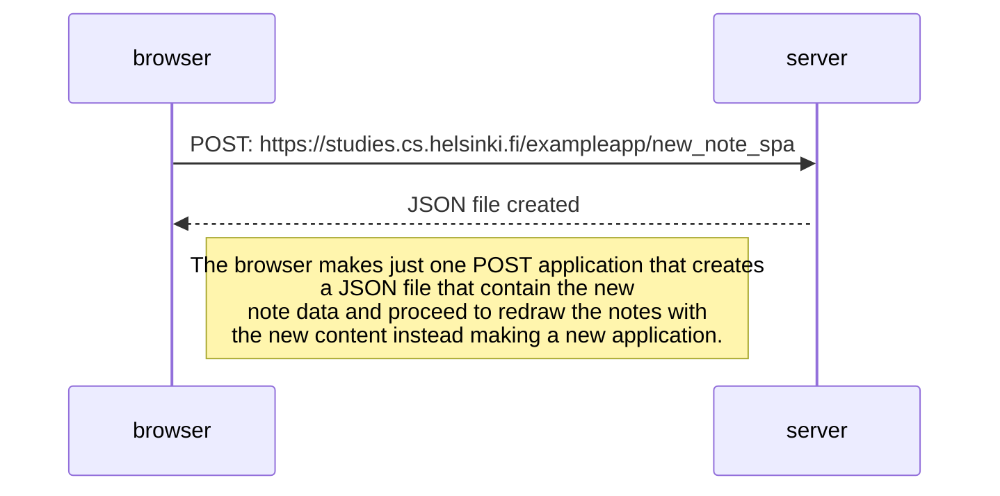

```mermaid
sequenceDiagram
    participant browser
    participant server

    browser->>server: POST: https://studies.cs.helsinki.fi/exampleapp/new_note_spa
    activate server
    server-->>browser: JSON file created
    activate browser

    Note right of browser: The browser makes just one POST application that creates <br> a JSON file that contain the new <br> note data and proceed to redraw the notes with <br> the new content instead making a new application.
```